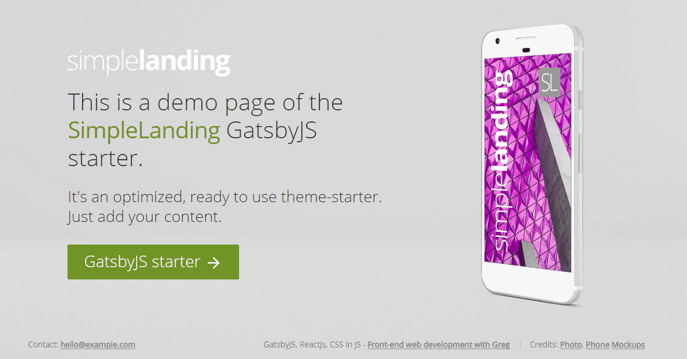

# SimpleLanding

A GatsbyJS landing page starter. <br /><br />

[](https://github.com/greglobinski/gatsby-starter-simple-landing/issues)
[](https://github.com/greglobinski/gatsby-starter-simple-landing/stargazers)
[](https://github.com/greglobinski/gatsby-starter-simple-landing/blob/master/LICENSE)
[](https://twitter.com/intent/tweet?text=Wow:&url=https%3A%2F%2Fgithub.com%2Fgreglobinski%2Fgatsby-starter-simple-landing)

  <br />

 <br />

  <br />

## Description

A simple, ready to use, easy to customize landing page starter for [GatsbyJS](https://github.com/gatsbyjs/gatsby) with auto generated, highly optimized in sizes & types Hero images.

The starter uses the css-in-js library [JSS](https://github.com/cssinjs/jss) and its integration
for React [React-JSS](https://github.com/cssinjs/react-jss) to declare and mantain CSS styles.

## Prerequisites

If you do not have Gatsby Cli installed yet, do it first.

```text
npm install --global gatsby-cli
```

More information on [GatsbyJS.org](https://www.gatsbyjs.org/tutorial/part-one/).

## Getting started

Install the starter using Gatsby Cli `gatsby new` command.

```text
gatsby new [NEW_SITE_DIRECTORY_FOR_YOUR_BLOG] https://github.com/greglobinski/gatsby-starter-simple-landing.git
```

Go into the newly created directory and run

```text
gatsby develop
```

to hot-serve your website on http://localhost:8000 or

```text
gatsby build
```

to create static site ready to host (/public).

## Customization

### Metadata

Edit `\src\utils\siteConfig.js`

```javascript
module.exports = {
  pathPrefix: "/",
  appName: "SimpleLanding",
  siteTitle: "SimpleLanding - a landing page GatsbyJs starter",
  siteUrl: "https://gssl.greglobinski.com",
  siteImage: "preview.jpg",
  siteLanguage: "en",
  siteDescription: "SimpleLanding is a dead simple landing page GatsbyJs starter.",
  contactEmail: "hello@example.com",
  ctaLinkUrl: "https://github.com/greglobinski/gatsby-starter-simple-landing",
  // manifest.json
  manifestName: "SimpleLanding - Gatsby starter",
  manifestShortName: "SimplLanding",
  manifestStartUrl: "/",
  manifestBackgroundColor: colors.bg,
  manifestThemeColor: colors.bg,
  manifestDisplay: "standalone",
  // analytics
  analyticsTrackingId: "UA-110088221-3"
};
```

### Color palette

Edit the `\src\styles\colors.js` file to customize the color palette.

```javascript
module.exports = {
  bg: "#D9D9D9",
  accent: "#709425",
  bright: "#ffffff",
  dark: "#333333",
  gray: "#777777"
};
```

### Style Theme

Edit the `\src\styles\theme.js` file to customize style of elements

```javascript
const theme = createMuiTheme({
  main: {
    colors: {
      background: colors.bg,
      text: colors.dark,
      link: colors.accent,
      linkHover: Color(colors.accent)
        .lighten(0.1)
        .string()
    },
    fonts: {
      unstyled: `"-apple-system", "BlinkMacSystemFont", "Segoe UI", "Roboto", "Oxygen", "Ubuntu", "Cantarell", "Fira Sans", "Droid Sans", "Helvetica Neue", "sans-serif"`,
      styled: "Open Sans"
    }
  },
  billboard: {
    colors: {
      text: colors.dark,
      textAccent: colors.accent,
      ctaLinkBackground: colors.accent,
      logo: colors.bright
    },
    sizes: {
      logoWidth: "200px",
      logoWidthForM: "300px",
      logoWidthForL: "50%",
      h1Font: 1.8,
      h2Font: 1.2,
      fontIncraseForM: 1.2,
      fontIncraseForL: 1.4
    }
  },
  footer: {
    colors: {
      text: colors.gray,
      link: Color(colors.gray)
        .lighten(0.2)
        .string(),
      linkHover: colors.gray
    },
    sizes: {
      height: "50px"
    }
  },
  mediaQueryTresholds: {
    M: 600,
    L: 1024
  }
});
```

## Content editing

### Text

Edit the `md` files in the `/scr/content/` directory to change text on the page.

### Images

Exchange `/src/images/phone.png`, '/src/images/pnone-perspective.png`and`/src/images/background.jpg`into your own. The responsive variants of the images will generated automaticaly during`gatsby develop`.

### Icons

Exchange `/src/images/icon.png` and `/src/images/apple-icon.png` into your own. Then run `yarn generate-manifest-icons` command to regenerate icons for android (`manifest.json`) and apple devices.

### Logo

Edit the `\src\images\logos.js`

```javascript
export default {
  MAIN: {
    viewBox: "...",
    path: (
      <g fillRule="evenodd" clipRule="evenodd" fill="#FFF">
        <path />
      </g>
    )
  }
};
```

## Authors

* Greg Lobinski [@greglobinski](https://github.com/greglobinski)

See also the list of [contributors](https://github.com/greglobinski/gatsby-starter-simple-landing/graphs/contributors) who participated in this project.

## Contributing

* Fork the repo
* Create your feature branch (git checkout -b feature/fooBar)
* Commit your changes (git commit -am 'Add some fooBar')
* Push to the branch (git push origin feature/fooBar)
* Create a new Pull Request

## Sites built with the starter

* [www.lazywill.com](https://www.lazywill.com/)

PR to add your page

## Licence

MIT License

Copyright (c) 2017 gatsbyjs <br />
Copyright (c) 2018 greg lobinski

Permission is hereby granted, free of charge, to any person obtaining a copy
of this software and associated documentation files (the "Software"), to deal
in the Software without restriction, including without limitation the rights
to use, copy, modify, merge, publish, distribute, sublicense, and/or sell
copies of the Software, and to permit persons to whom the Software is
furnished to do so, subject to the following conditions:

The above copyright notice and this permission notice shall be included in all
copies or substantial portions of the Software.

THE SOFTWARE IS PROVIDED "AS IS", WITHOUT WARRANTY OF ANY KIND, EXPRESS OR
IMPLIED, INCLUDING BUT NOT LIMITED TO THE WARRANTIES OF MERCHANTABILITY,
FITNESS FOR A PARTICULAR PURPOSE AND NONINFRINGEMENT. IN NO EVENT SHALL THE
AUTHORS OR COPYRIGHT HOLDERS BE LIABLE FOR ANY CLAIM, DAMAGES OR OTHER
LIABILITY, WHETHER IN AN ACTION OF CONTRACT, TORT OR OTHERWISE, ARISING FROM,
OUT OF OR IN CONNECTION WITH THE SOFTWARE OR THE USE OR OTHER DEALINGS IN THE
SOFTWARE.
